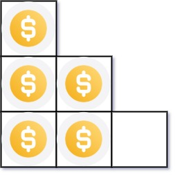
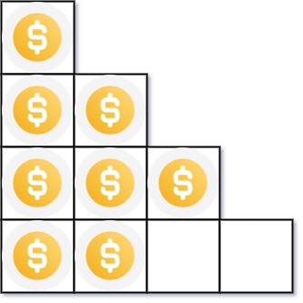

# 排列硬币

你总共有 `n` 枚硬币，并计划将它们按阶梯状排列。对于一个由 `k` 行组成的阶梯，其第 `i` 行必须正好有 `i` 枚硬币。阶梯的最后一行 **可能** 是不完整的。

给你一个数字 `n` ，计算并返回可形成 **有效阶梯行** 的总行数。

## 示例 1：

>### 输入：
>n = 5
>### 输出：
>2
>### 解释：
>因为第四行不完整，所以只有 2 行有效。

## 示例 2：

>### 输入：
>n = 8
>### 输出：
>3
>### 解释：
>因为第三行不完整，所以只有 3 行有效。

## 代码：

1.

    public class Solution {
        public int ArrangeCoins(int n) {
            int i=1;
            while((n-=i)>=0){
                i++;
            }
            return i-1;
        }
    }
2.

    public class Solution {
        public int ArrangeCoins(int n) {
            return (int)((-1 + Math.Sqrt(1 + 8 * (double)n)) / 2);
        }
    }
3.

    public class Solution {
        public int ArrangeCoins(int n) {
            int row = 0;
            long sum = 0;
            while (sum + row + 1 <= n) {
                row++;
                sum += row;
            }
            return row;
        }
    }

